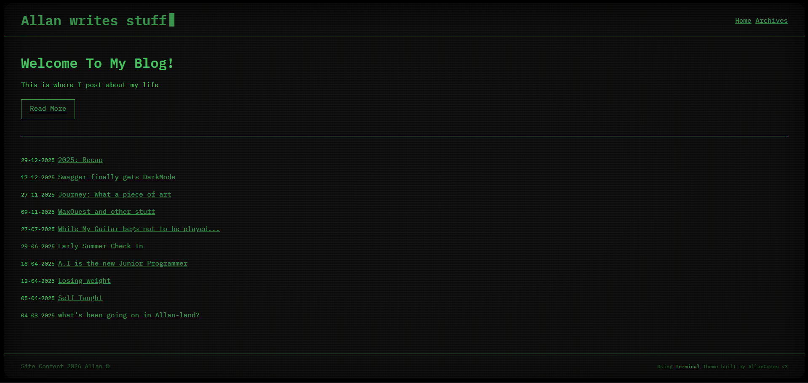

# Terminal
Terminal is a minimal, retro sci-fi inspired theme for the Static Site Generator Hexo.

The aim of the theme is to cater to anyone who want a simple - yet readable blog, with a quirky / cheesy theme.

I started this as a personal project to learn more about Hexo, just for fun.
A lazy weekend project whilst I spin some records in the background.

However, I enjoyed building this theme and wanted to contribute something back to the Hexo community, seeing as I use it for my own static blog generation.

# TOD:
  - Implement more custmisation features 
  - Add more templates for other layouts ( work history / timeline / about / projects etc )
  - Blog pages should have forward/back or "Read Similar"
  - Posts should use tags 
  - Archive template should function as a search post by X page
  - Add support for featured images on blog posts